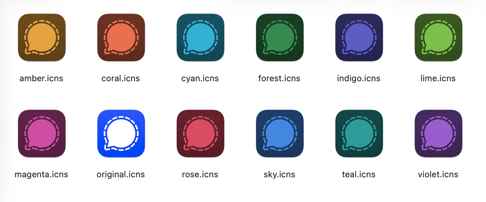

# Signal VOIP Registration Helper

**macOS only.** Register a new Signal account using [`signal-cli`](https://github.com/AsamK/signal-cli) (no physical phone), then link **Signal Desktop** as a second device. Good for Google Voice / VOIP numbers and running **multiple Signal numbers** from one Mac.

**Not** for “I already use Signal on my phone and only want another Desktop” — see [this wiki guide](https://github.com/blanchardjeremy/signal-voip-registration-helper/wiki/How-to-run-multiple-Signal-Desktop-instances-on-macOS) instead.

Early-stage tool. Don’t use it to spam.



## Quick start

1. **Get a number** you can receive SMS on (see [Phone numbers](#phone-numbers) below).

2. **Install, clone, and run the wizard** ([Homebrew](https://brew.sh/) required for `brew`):

   ```bash
   # Install dependences (zbar is for QR scanning)
   brew install signal-cli zbar

   # This repository
   git clone https://github.com/blanchardjeremy/signal-voip-registration-helper
   cd signal-voip-registration-helper

   # Interactive setup (captcha, SMS, Desktop link, …)
   ./signal_voip_helper.py
   ```

The wizard walks you through captcha, SMS verification, optional launcher icon, copying the app to `~/Applications`, daily `signal-cli receive`, and linking Desktop (QR code).

**Captcha (registration):** open [signalcaptchas.org/registration/generate.html](https://signalcaptchas.org/registration/generate.html), solve it, right‑click **Open Signal** → **Copy link address**, paste when asked.

## Phone numbers

You need **some** number for Signal; it doesn’t have to be a cell plan. [VOIP](https://en.wikipedia.org/wiki/Voice_over_IP) is fine.

| Option | Notes |
|--------|--------|
| [Google Voice](https://workspace.google.com/products/voice/) | Free. The number can lapse if unused (Google Voice’s rules, not Signal’s). |
| [MySudo](https://anonyome.com/individuals/mysudo/) | Paid tiers. |

**Riskier (temporary numbers):** [SMSPool](https://smspool.net/) and similar — cheap, but you may not keep the number. If you use them, set a [Signal PIN + registration lock](https://support.signal.org/hc/en-us/articles/360007059792-Signal-PIN) and check the number regularly, or someone else could register it later.

## Command-line (skip the wizard)

```bash
./signal_voip_helper.py register +15551112222 --captcha '<token>'
./signal_voip_helper.py addDevice +15551112222
```

| Command | Purpose |
|---------|---------|
| `regenerateLauncher` | Rebuild the `Signal-….app` for an existing profile. Run with no args to pick a profile, or pass `+number`. Use `--copy-to-user-applications` or `-o` if you want it in `~/Applications` or another folder. |
| `installReceiveJob` / `uninstallReceiveJob` | Install or remove a macOS LaunchAgent that runs `signal-cli receive` on a schedule (about twice a day and at login). Logs live under `~/Library/Logs/signal-voip-registration-helper/`. |

Run `./signal_voip_helper.py --help` for flags (`--launcher-icon`, `-o`, etc.).

## Troubleshooting

* **`signal-cli` not found** — Run `brew install signal-cli` and make sure Homebrew’s bin directory is on your `PATH`.
* **No SMS code** — Use international format (`+` and country code). For Google Voice, check spam and filters.
* **Linking fails** — Generate a new QR in Signal Desktop if it may have expired. The pasted link must start with `sgnl://linkdevice?`. Quit Signal Desktop first when the wizard asks (linking won’t work if it is already running).

## Security

Treat phone numbers and codes like secrets. This project doesn’t phone home; Signal traffic is between your machine and Signal’s servers. Data lives under `~/.local/share/signal-cli/data/` and your Desktop profile dirs.

## Features (what’s included)

* Register with **signal-cli**, captcha, and SMS verification. The wizard can turn on **registration lock** with `setPin`.
* **Link Signal Desktop** as a second device (signal-cli stays primary). Helpers for scanning or pasting the link QR.
* **Colored launcher apps** (`Signal-….app`) and optional copy into **`~/Applications`**.
* **Regenerate launcher** if you removed the app or want a different icon or name.
* **Optional daily `receive` job** on macOS (LaunchAgent) so messages are fetched without running `signal-cli` by hand.

## License

[LICENSE.txt](./LICENSE.txt)

## Contributing

Issues and PRs welcome.
